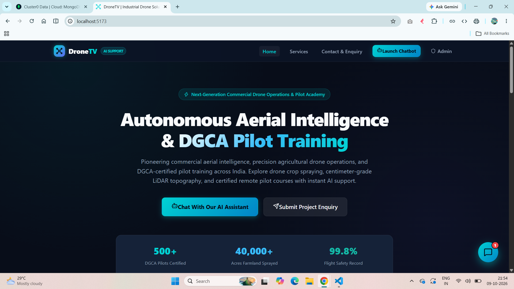
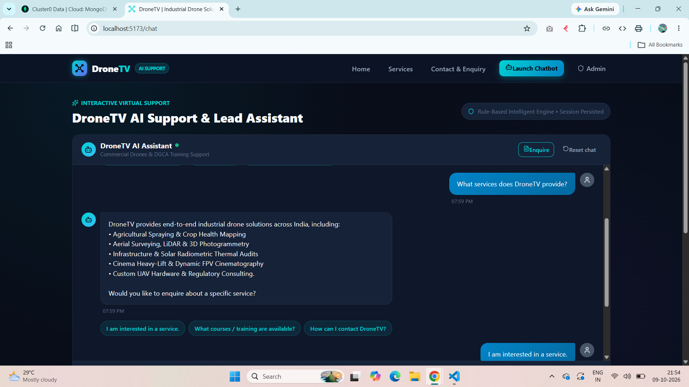
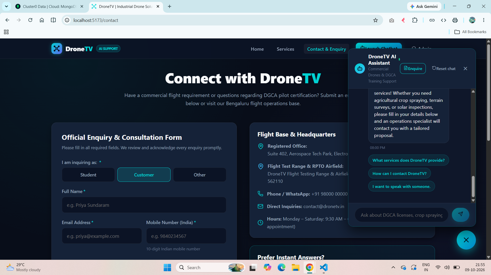
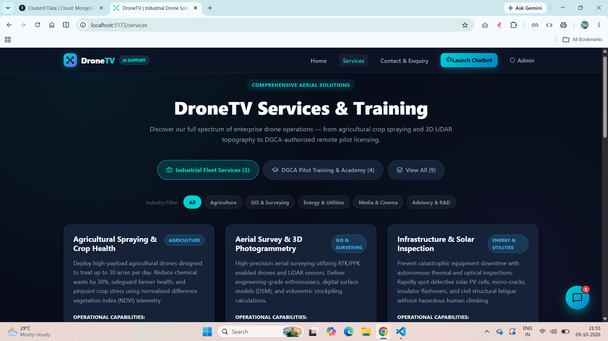
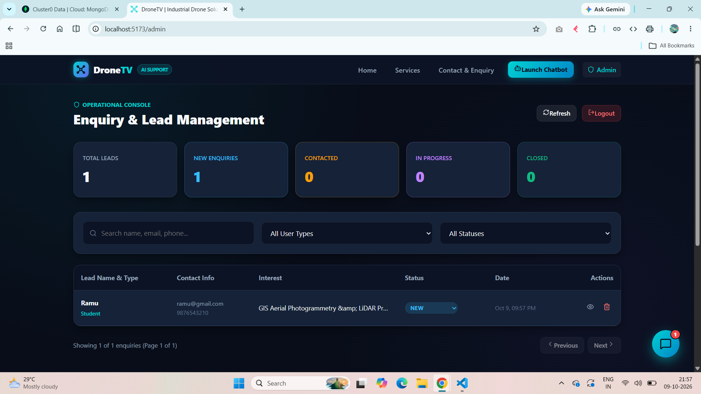

# DroneTV AI Support & Lead Assistant

An original, full-stack responsive web application featuring a rule-based intelligent chatbot, lead capture engine, and protected administrative dashboard designed for **DroneTV** — India's premier commercial drone operations and DGCA pilot training academy.

[](https://react.dev/)
[](https://nodejs.org/)
[](https://www.mongodb.com/)
[](https://vercel.com/)
[](https://render.com/)

---

## 🌐 Live Demo & Deployment Links

| Service | Platform | URL | Status |
| :--- | :--- | :--- | :--- |
| **Frontend Application** | **Vercel** | [https://dronetv.vercel.app](https://dronetv.vercel.app) *(Replace with your Vercel URL)* | Live |
| **Backend REST API** | **Render** | [https://dronetv-backend.onrender.com](https://dronetv-backend.onrender.com) *(Replace with your Render URL)* | Live |
| **API Health Check** | **Render** | [https://dronetv-backend.onrender.com/api/health](https://dronetv-backend.onrender.com/api/health) | `{"status":"ok"}` |

> 🔑 **Admin Portal Credentials**: Visit `/admin` on your frontend deployment:
> - **Username**: `admin`
> - **Password**: `admin123`

---

## Table of Contents

1. [Project Description](#project-description)
2. [Key Features](#key-features)
3. [Technologies Used](#technologies-used)
4. [System Architecture & Data Flow](#system-architecture--data-flow)
5. [Monorepo Project Structure](#monorepo-project-structure)
6. [UI Screenshots](#ui-screenshots)
7. [Environment Variables](#environment-variables)
8. [Setup & Installation](#setup--installation)
9. [Database Setup (Local & Atlas)](#database-setup-local--atlas)
10. [Run Instructions (Frontend & Backend)](#run-instructions-frontend--backend)
11. [Running Tests](#running-tests)
12. [API Endpoints Reference](#api-endpoints-reference)
13. [Security & Error Handling](#security--error-handling)

---

## Project Description

DroneTV requires a dependable, modern web platform that educates prospective students and enterprise clients on commercial drone services (agricultural spraying, 3D photogrammetry, solar thermography, industrial inspection, cinematography) and DGCA remote pilot licensing, while seamlessly converting inquiries into qualified leads.

This project delivers:
- A **100% rule-based intelligent chatbot** (eliminating external LLM latency, recurring subscription costs, and hallucination risks) that answers inquiries, matches typed queries using keyword and intent scoring, preselects user personas (Student vs. Customer), and captures lead submissions with inline validation.
- A **responsive client portal** with a full services directory, training courses catalog, contact form, and persistent floating chat assistant.
- A **protected administrative dashboard** with real-time lead analytics, status management (`New`, `Contacted`, `In Progress`, `Closed`), search with ReDoS protection, filters, and record deletion.

---

## Key Features

- **Interactive Rule-Based Chatbot**:
  - Full-screen support page at `/chat` plus a persistent floating chat bubble across all pages.
  - Answers predefined inquiries with instant response times and zero external API dependencies.
  - Intelligent role preselection: *"I am a student"* pre-selects Student; *"interested in a service"* pre-selects Enterprise Customer.
  - Natural fallback mechanism with quick-guidance suggestion chips.
  - Chat state persistence via `sessionStorage` (survives page reloads).
  - Clear conversation button with confirmation dialog.
  - Animated typing indicators and automatic smooth scroll.
- **Lead / Enquiry Capture**:
  - In-chat slide-out drawer form and standalone `/contact` page form.
  - Dual validation on client (`utils/validators.js`) and server (`express-validator`).
  - Strict Indian mobile phone validation (`+91` or 10 digits starting with 6–9).
  - Generates a human-friendly reference ID (`DTV-XXXXXX`) upon successful submission.
- **Centralized Business Content**:
  - All company descriptions, services, training courses, and contact details live in `frontend/src/data/siteContent.js` for instant maintenance.
- **Protected Admin Dashboard (`/admin`)**:
  - Secure JWT authentication with pre-hashed credentials (`admin` / `admin123`).
  - Summary metric cards broken down by status (Total, New, Contacted, In Progress, Closed).
  - Search across names, emails, phone numbers, and messages with ReDoS-safe regex escaping.
  - Filter by persona (`student` / `customer`) and lead status with pagination.
  - Modal detail view with complete enquiry information.
  - Inline status update dropdown with instant database synchronization and toast notifications.
  - Confirmation dialogs for deletion operations.
- **Modern Original Design**:
  - Aerospace-inspired color system (Deep Aerospace Navy `#080d19`, Aero Cyan `#00d2d3`, Sky Blue `#38bdf8`).
  - Semantic HTML5, accessible ARIA attributes, and smooth glassmorphism.
  - Fully responsive across mobile (~360px), tablet (768px), and desktop (1280px+).

---

## Technologies Used

| Layer | Technology | Purpose & Rationale |
| :--- | :--- | :--- |
| **Frontend Framework** | **React 19 (Vite)** | Ultra-fast build times, modular component architecture, and modern React hooks |
| **Routing** | **React Router v7** | Seamless client-side navigation with SPA history support |
| **Styling** | **Vanilla CSS** | Tailored design system, CSS custom properties, and zero heavy library bloat |
| **Icons** | **Lucide React** | Lightweight aviation, telemetry, and navigation iconography |
| **Backend API** | **Node.js & Express.js** | Modular REST API with structured routing, controllers, and middleware |
| **Database** | **MongoDB & Mongoose** | Document database with schema enforcement, indexing, and validation |
| **Security & Hardening** | **Helmet, CORS, Rate Limit, Mongo Sanitize** | Defense in depth against XSS, NoSQL injection, and brute force attacks |
| **Data Validation** | **express-validator & regex** | Exact field verification on client and server |
| **Testing** | **Vitest (Frontend) & Jest + Supertest (Backend)** | Complete unit tests for chatbot logic and integration tests for REST endpoints |
| **Frontend Deployment**| **Vercel** | Global CDN distribution, instant preview builds, and custom domain support |
| **Backend Deployment** | **Render** | Managed Node.js web services with automatic builds, health checks, and HTTPS |

---

## System Architecture & Data Flow

```text
[ Browser / Client ]
   │
   ├─► React UI (Home / Services / Courses / Contact / Chat / Admin)
   │     │
   │     ▼
   ├─► Local State & Chatbot Engine (rule matching + sessionStorage)
   │     │
   │     ▼
   ├─► Frontend Validators (validators.js)
   │     │
   │     ▼ (HTTP REST JSON via services/api.js)
   ▼
[ Express.js Backend on Render (Port 5000 / ENV) ]
   │
   ├─► Security Middleware (Helmet, CORS, express-mongo-sanitize)
   ├─► Rate Limiters (submissionLimiter, loginLimiter)
   ├─► Route Handlers (/api/enquiries, /api/admin, /api/health)
   ├─► express-validator (validates name, email, Indian phone format)
   ├─► Auth Middleware (JWT Bearer verification for Admin routes)
   │     │
   │     ▼
   ├─► Controllers & Mongoose Models (Enquiry.js)
   │     │
   │     ▼
[ MongoDB Database (Atlas Cloud or Local) ]
   └─► Collection: 'enquiries' (Indexed on status, userType, createdAt)
```

---

## Monorepo Project Structure

```text
FullStack_Chatbot/
├── backend/
│   ├── scripts/
│   │   └── seed.js                 # Seeds 8 realistic DroneTV sample records
│   ├── src/
│   │   ├── config/
│   │   │   └── db.js               # Mongoose connection with error handling
│   │   ├── controllers/
│   │   │   ├── authController.js   # Admin JWT login and verification
│   │   │   └── enquiryController.js# CRUD, search, filtering, and stats metrics
│   │   ├── middleware/
│   │   │   ├── authMiddleware.js   # JWT Bearer token protection
│   │   │   ├── errorHandler.js     # Central error handler & 404 handler
│   │   │   └── rateLimiter.js      # Rate limiters for auth and lead submission
│   │   ├── models/
│   │   │   └── Enquiry.js          # Mongoose schema, enums, and indexes
│   │   ├── routes/
│   │   │   ├── authRoutes.js       # /api/admin/login & /verify
│   │   │   ├── enquiryRoutes.js    # /api/enquiries endpoints
│   │   │   └── healthRoutes.js     # /api/health monitoring endpoint
│   │   ├── utils/
│   │   │   └── sanitize.js         # Regex escaping for search ReDoS prevention
│   │   ├── validators/
│   │   │   └── enquiryValidators.js# express-validator rules
│   │   ├── app.js                  # Express app setup (exported for Supertest)
│   │   └── server.js               # Server bootstrap & graceful shutdown
│   ├── tests/
│   │   └── enquiry.test.js         # 14 integration tests (Jest + Supertest)
│   ├── .env.example                # Template for backend environment variables
│   ├── .env                        # Local backend environment configuration
│   └── package.json
│
├── frontend/
│   ├── public/                     # Static assets & favicon
│   ├── src/
│   │   ├── components/             # Button, Input, Select, Card, Modal,
│   │   │                           # Toast, Loader, EmptyState, Navbar, Footer,
│   │   │                           # ChatInterface, ChatEnquiryForm, ChatWidget
│   │   ├── data/
│   │   │   └── siteContent.js      # Centralized business content file
│   │   ├── hooks/
│   │   │   └── useChat.js          # Chatbot state with sessionStorage sync
│   │   ├── pages/
│   │   │   ├── HomePage.jsx        # Landing hero, proof points, service previews
│   │   │   ├── ServicesPage.jsx    # Commercial drone service cards & filter
│   │   │   ├── CoursesPage.jsx     # DGCA courses and training syllabus
│   │   │   ├── ContactPage.jsx     # Standalone enquiry form with validation
│   │   │   ├── ChatPage.jsx        # Dedicated full-page chatbot
│   │   │   ├── AdminLoginPage.jsx  # Admin login screen
│   │   │   ├── AdminDashboardPage.jsx # Lead management dashboard
│   │   │   └── NotFoundPage.jsx    # Themed 404 error page
│   │   ├── services/
│   │   │   └── api.js              # Native fetch client for backend endpoints
│   │   ├── utils/
│   │   │   ├── chatbotEngine.js    # Rule matching, questions, fallbacks
│   │   │   ├── chatbotEngine.test.js # 14 Vitest unit tests
│   │   │   └── validators.js       # Client validation logic
│   │   ├── App.jsx                 # Routes & layout structure
│   │   ├── index.css               # Vanilla CSS design tokens & utilities
│   │   └── main.jsx
│   ├── index.html
│   ├── vercel.json                 # Vercel SPA routing configuration
│   ├── .env.example                # Template for frontend environment variables
│   ├── .env                        # Local frontend environment configuration
│   └── package.json
│
├── database/
│   ├── README.md                   # Setup guide (Local & Atlas) + sample docs
│   └── seed-data.json              # 8 realistic DroneTV sample records
│
├── docs/
│   ├── API_DOCUMENTATION.md        # Comprehensive endpoint reference + cURL
│   ├── postman_collection.json     # Importable Postman collection
│   └── Screenshots/                # Visual UI screenshots
│       ├── 01_landing_hero.png
│       ├── 02_chatbot_screen.png
│       ├── 03_in_chat_enquiry.png
│       ├── 04_services_directory.png
│       └── 05_admin_dashboard.png
│
├── .gitignore
└── README.md
```

---

## UI Screenshots

The screenshots below illustrate the key interfaces of the DroneTV platform:

### 1. Landing Hero & Live Metrics
> Aerospace-themed hero section with live performance metrics, trust indicators, and quick action buttons.



---

### 2. Intelligent Rule-Based Chatbot (`/chat`)
> Full-screen conversational assistant with instant response matching, quick suggestions, and session persistence.



---

### 3. In-Chat Lead Capture & Enquiry Drawer
> Embedded responsive enquiry drawer preselecting the user persona (Student / Enterprise Customer) with validation.



---

### 4. Commercial Drone Services Directory (`/services`)
> Detailed service catalog showcasing enterprise aerial solutions (agricultural spraying, mapping, inspection, filming).



---

### 5. Protected Administrative Dashboard (`/admin`)
> Role-secured management interface displaying real-time lead metrics, search, status changer, and modal view.



---

## Environment Variables

### Backend (`backend/.env`)

Create `backend/.env` (or copy from `backend/.env.example`):

| Variable | Default Value | Description |
| :--- | :--- | :--- |
| `PORT` | `5000` | Port for Express HTTP server |
| `NODE_ENV` | `development` | Runtime mode (`development` or `production`) |
| `MONGODB_URI`| `mongodb://localhost:27017/dronetv_db` | MongoDB connection URI (local or MongoDB Atlas) |
| `JWT_SECRET` | *(Random secure string)* | Secret key used to sign Admin JWT tokens |
| `JWT_EXPIRES_IN` | `7d` | Lifetime of admin session token |
| `ADMIN_USERNAME` | `admin` | Username for dashboard login |
| `ADMIN_PASSWORD_HASH`| *(Bcrypt hash for 'admin123')* | Pre-hashed admin password |
| `CORS_ORIGIN`| `http://localhost:5173` | Allowed frontend origin (set to Vercel URL in production) |

### Frontend (`frontend/.env`)

Create `frontend/.env` (or copy from `frontend/.env.example`):

| Variable | Default Value | Description |
| :--- | :--- | :--- |
| `VITE_API_BASE_URL` | `http://localhost:5000/api` | Base URL of backend REST API (set to Render URL in production) |

---

## Setup & Installation

Clone or extract the repository, then install dependencies for both services:

```bash
# 1. Install Backend Dependencies
cd backend
npm install

# 2. Install Frontend Dependencies
cd ../frontend
npm install
```

---

## Database Setup (Local & Atlas)

### Option A: Local MongoDB
Ensure your local MongoDB daemon is running:
```powershell
# Windows PowerShell:
Get-Service -Name *mongo*
# If stopped:
Start-Service -Name MongoDB
```
*Local URI: `mongodb://localhost:27017/dronetv_db`*

### Option B: MongoDB Atlas (Recommended for Production & Cloud)
1. Create a free cluster on [MongoDB Atlas](https://www.mongodb.com/atlas).
2. Create a Database User with read/write permissions.
3. In **Network Access**, add `0.0.0.0/0` (Allow access from anywhere) so Render and your local environment can connect.
4. Copy your connection string into `backend/.env`:
   ```env
   MONGODB_URI=mongodb+srv://<username>:<password>@cluster0.mongodb.net/dronetv_db?retryWrites=true&w=majority
   ```

### Populate Seed Data
Populate the database with 8 realistic sample enquiries:
```bash
cd backend
npm run seed
```

---

## Run Instructions (Frontend & Backend)

Run the backend and frontend in two separate terminal windows:

### Terminal 1: Backend Server
```bash
cd backend
npm run dev
```
- Server starts at: **`http://localhost:5000`**
- Health check: **`http://localhost:5000/api/health`**

### Terminal 2: Frontend Client
```bash
cd frontend
npm run dev
```
- Client starts at: **`http://localhost:5173`**

### Accessing the Applications Locally
- **Public Portal**: Open [http://localhost:5173](http://localhost:5173) in your browser.
- **Dedicated Chat Page**: [http://localhost:5173/chat](http://localhost:5173/chat)
- **Admin Dashboard**: [http://localhost:5173/admin](http://localhost:5173/admin)
  - **Username**: `admin`
  - **Password**: `admin123`

---

## Running Tests

Both frontend and backend include automated test suites:

### Backend Tests (Jest + Supertest)
```bash
cd backend
npm test
```
*Executes 14 integration tests verifying health checks, authentication, public lead submission, 422 validations, protected admin CRUD, 400 bad IDs, and 404 errors.*

### Frontend Tests (Vitest)
```bash
cd frontend
npm test
```
*Executes 14 unit tests validating the chatbot engine, predefined query matching, role preselection, and fallback states.*

---

## API Endpoints Reference

| Method | Endpoint | Access | Purpose |
| :--- | :--- | :--- | :--- |
| `GET` | `/api/health` | Public | System status and database check |
| `POST` | `/api/admin/login` | Public (Rate limited) | Admin authentication & JWT token |
| `GET` | `/api/admin/verify` | Admin (JWT) | Validates active admin session |
| `POST` | `/api/enquiries` | Public (Rate limited) | Submit new student or customer lead |
| `GET` | `/api/enquiries` | Admin (JWT) | List enquiries with search, filters & pagination |
| `GET` | `/api/enquiries/:id` | Admin (JWT) | Retrieve single enquiry details |
| `PATCH`| `/api/enquiries/:id` | Admin (JWT) | Update status (`New`, `Contacted`, `In Progress`, `Closed`) |
| `DELETE`| `/api/enquiries/:id` | Admin (JWT) | Remove an enquiry record |

*For complete cURL examples and JSON payload schemas, see [docs/API_DOCUMENTATION.md](file:///d:/FullStack_Chatbot/docs/API_DOCUMENTATION.md) and import [docs/postman_collection.json](file:///d:/FullStack_Chatbot/docs/postman_collection.json).*

---

## Security & Error Handling

- **Defense Against Injection**:
  - `express-mongo-sanitize` strips `$` and `.` operators from request bodies to prevent NoSQL query tampering.
  - User search queries are escaped using `escapeRegex` to prevent Regular Expression Denial of Service (ReDoS).
- **Client & Server Validation Parity**:
  - Immediate feedback on frontend; strict enforcement on backend via `express-validator` and `checkValidationErrors`.
- **Brute-Force & Flood Protection**:
  - `adminLoginLimiter`: Max 10 attempts per 15 minutes.
  - `enquirySubmissionLimiter`: Max 25 submissions per 15 minutes per IP.
- **Secure Token Handling**:
  - Admin endpoints require `Authorization: Bearer <token>` verified with `jsonwebtoken`.
  - Passwords are securely hashed using `bcryptjs`.
- **Information Leak Prevention**:
  - The central error handler suppresses database stack traces and collection names in production, returning friendly user errors.

---
